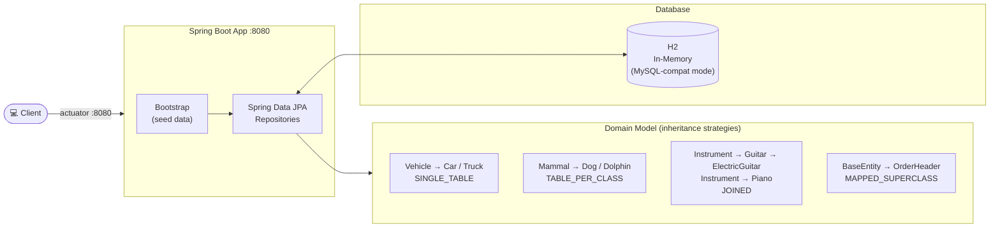
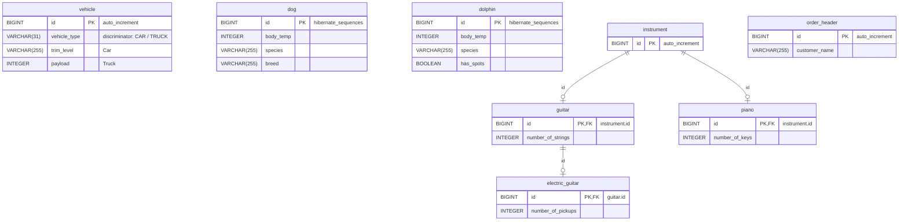

# Spring Data JPA Inheritance

Spring Boot 4 / Spring Data JPA demo project on Java 25, demonstrating the four JPA inheritance
strategies — **single table**, **table per class**, **joined**, and **mapped superclass** — against H2
in MySQL-compat mode. The schema is generated by Hibernate (`ddl-auto: create-drop`); each strategy lives
in its own `domain`/`repository` package and is covered by a `@DataJpaTest` slice.

## Architecture Overview



## Database Schema



## Additional Resources

This project focuses on inheritance in JPA. For more information about inheritance, transactions in database systems, and Spring Data JPA, please refer to the following documents in the `doc` folder:

- [Inheritance Overview](doc/InheritanceOverview.pdf): This document provides a comprehensive overview of inheritance in JPA.

## Deployment with Helm

Deployment is Helm-only and goes into the `sdjpa-inheritance` namespace (not `default`).

To run maven filtering for destination `target/helm-charts`

```bash
./mvnw clean install -DskipTests
```

Go to the directory where the tgz file has been created after `./mvnw install`

```powershell
cd target/helm/repo
```

unpack

```powershell
$file = Get-ChildItem -Filter sdjpa-inheritance-chart-*.tgz | Select-Object -First 1
tar -xvf $file.Name
```

install

```powershell
$APPLICATION_NAME = Get-ChildItem -Directory | Where-Object { $_.LastWriteTime -ge $file.LastWriteTime } | Select-Object -ExpandProperty Name
helm upgrade --install $APPLICATION_NAME ./$APPLICATION_NAME --namespace sdjpa-inheritance --create-namespace --wait --timeout 8m --debug --render-subchart-notes
```

show logs

```powershell
kubectl get pods -l app.kubernetes.io/name=sdjpa-inheritance -n sdjpa-inheritance
```

replace $POD with pods from the command above

```powershell
kubectl logs $POD -n sdjpa-inheritance --all-containers
```

test

```powershell
helm test $APPLICATION_NAME --namespace sdjpa-inheritance --logs
```

uninstall

```powershell
helm uninstall $APPLICATION_NAME --namespace sdjpa-inheritance
```

delete all

```powershell
kubectl delete all --all -n sdjpa-inheritance
```

create busybox sidecar

```powershell
kubectl run busybox-test --rm -it --image=busybox:1.37.0 --namespace=sdjpa-inheritance --command -- sh
```

Use the actuator endpoint to verify the application is healthy via NodePort `30080`.

## Sandbox (local dev environment)

The sandbox is provisioned by the opencode-sandbox-kit and runs as a Docker container. It mounts this
repo, starts the agent, and connects the IntelliJ MCP server. The app runs on port `8080` and uses an
in-memory H2 database (no Docker service needed).

Allow the kit source (GitHub without cloning):

```powershell
sbx settings set kit.allowedSources --% "[\"docker.io/\",\"github.com/dboeckli/\"]"
```

Start a new sandbox:

```powershell
sbx run opencode `
    --kit "git+https://github.com/dboeckli/opencode-sandbox-kit.git#dir=opencode-agent" `
    --template docker/sandbox-templates:opencode-docker-0.5.0 `
    --no-share-skills `
    --static-mcp idea `
    . `
    "C:\development\maven-repo:ro"
```

Start the sandbox with Kubernetes support:

```powershell
sbx run opencode `
    --kit "git+https://github.com/dboeckli/opencode-sandbox-kit.git#dir=opencode-agent" `
    --template docker/sandbox-templates:opencode-docker-0.5.0 `
    --no-share-skills `
    --static-mcp idea `
    . `
    "C:\development\maven-repo:ro" `
    "$env:USERPROFILE\.kube:ro"
```

Claude Code (Home) and Mammouth Code variants:

```powershell
sbx run claude `
    --kit "git+https://github.com/dboeckli/opencode-sandbox-kit.git#dir=opencode-agent" `
    --template docker/sandbox-templates:claude-code-docker-0.5.0 `
    --no-share-skills `
    --static-mcp idea `
    . `
    "C:\development\maven-repo:ro"
```

```powershell
sbx run "git+https://github.com/dboeckli/opencode-sandbox-kit.git#dir=mammouth-agent" `
    --no-share-skills `
    --static-mcp idea `
    . `
    "C:\development\maven-repo:ro"
```

### Start the app

Run the `Spring6Application h2` run configuration in IntelliJ
(`.run/Spring6Application h2.run.xml`) or start via `./mvnw spring-boot:run` (H2, no Docker needed).

### Sandbox build quirk

The sandbox mounts the repo via filesystem passthrough, which blocks symlinks — Spotless's `npm install`
(prettier) would fail with `EPERM` unless npm skips bin links. The kit sets `npm_config_bin_links=false`
globally, so no manual export is needed.

